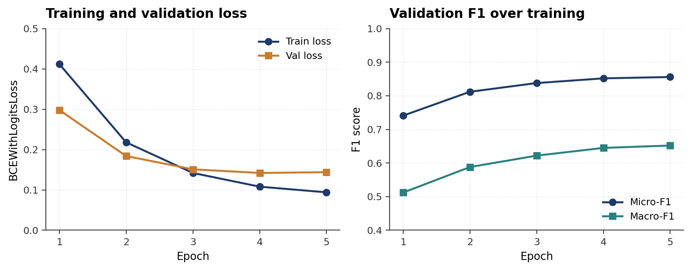
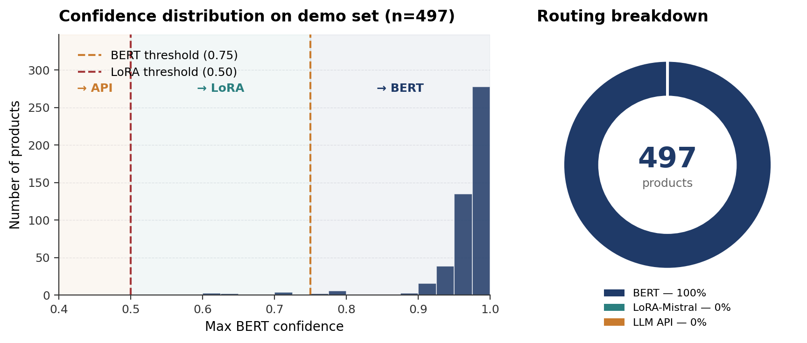

# Shopify Product Tagger: A Confidence-Calibrated Multi-Agent LLM Pipeline

**Felicia D. O'Garro**  
CSCI E-222 — Foundations of Large Language Models  
Harvard Extension School · Spring 2026

**Video Presentation:** `[INSERT VIDEO URL HERE]`  
**GitHub Repository:** https://github.com/fdogarro/shopify-tagger

---

## Abstract

This project presents a multi-agent pipeline for automatically assigning Shopify product taxonomy tags to e-commerce product listings. Merchants selling on Shopify must manually categorize products using a standardized tag taxonomy, a process that is time-consuming, inconsistent, and error-prone at scale. The pipeline addresses this by routing each product through a confidence-calibrated chain of models: a fine-tuned BERT classifier for high-confidence predictions, a QLoRA-adapted Mistral-7B model for ambiguous cases, and a few-shot LLM API call (Claude Haiku or GPT-4o-mini) for out-of-distribution products. Five specialized agents — Preprocessor, BERT Classifier, Model Selector, LLM API Tagger, and Validator — collaborate to produce validated tag predictions. Trained on 61,102 products drawn from 21 Amazon product categories and evaluated against a 30-label Shopify-compatible taxonomy, the pipeline achieves a micro-F1 of 0.856 with BERT and 0.868 with LoRA-Mistral, at inference latencies of 15ms and 263ms respectively. The confidence-based routing mechanism is designed to direct in-distribution products to the fastest, cheapest model while reserving more expensive paths for ambiguous or out-of-distribution cases.

---

## 1. Introduction and Problem Statement

Product tagging is a foundational task in e-commerce. When a merchant lists a product on Shopify, assigning the correct taxonomy tags determines how the product appears in search, recommendations, and category pages. Poor tagging leads to reduced discoverability, lower conversion rates, and a degraded customer experience.

At small scale, manual tagging is feasible. At scale — tens of thousands of SKUs, multiple storefronts, frequent catalog updates — it becomes impractical. Existing rule-based systems are brittle and fail on novel products. General-purpose LLMs are capable but expensive to call for every product in a large catalog.

This project builds a practical solution to this problem: a multi-agent pipeline that combines the speed and low cost of a fine-tuned BERT classifier with the reasoning ability of a large language model, routing each product to the most appropriate model based on confidence. The pipeline is designed to be accurate, fast, and cost-efficient simultaneously.

**Task definition:** Given a product title and description, assign one or more tags from a fixed 30-label taxonomy that maps to Shopify's standard product categories.

---

## 2. Data Description and Preprocessing

### 2.1 Data Source

**Dataset:** McAuley Lab Amazon Reviews 2023  
**Host:** HuggingFace Datasets  
**URL:** https://huggingface.co/datasets/McAuley-Lab/Amazon-Reviews-2023  
**License:** Amazon Customer Reviews Dataset license (research use)

The dataset contains product metadata (titles, descriptions, categories, brand) for millions of Amazon products across dozens of categories. This project uses only the `raw_meta_{Category}` splits, which contain product metadata without review text.

### 2.2 Category Selection

21 Amazon categories were selected to ensure coverage across all 30 taxonomy labels:

```
All_Beauty, Toys_and_Games, Cell_Phones_and_Accessories,
Industrial_and_Scientific, Musical_Instruments, Electronics,
Clothing_Shoes_and_Jewelry, Arts_Crafts_and_Sewing, Office_Products,
Home_and_Kitchen, Sports_and_Outdoors, Automotive, Video_Games,
Pet_Supplies, Software, Health_and_Household, Patio_Lawn_and_Garden,
Tools_and_Home_Improvement, Books, Grocery_and_Gourmet_Food, Baby_Products
```

### 2.3 Taxonomy

The target taxonomy contains 30 labels aligned with Shopify's standard product categories:

| ID | Tag | Description |
|----|-----|-------------|
| 0 | electronics | Consumer electronics and components |
| 1 | computers | Laptops, desktops, peripherals |
| 2 | phones | Smartphones, tablets, accessories |
| 3 | audio | Headphones, speakers, microphones |
| 4 | cameras | Cameras, lenses, photography gear |
| 5 | tv-video | Televisions, monitors, projectors |
| 6 | clothing | Apparel and fashion items |
| 7 | shoes | Footwear for all genders and ages |
| 8 | jewelry | Jewelry and watches |
| 9 | bags | Bags, luggage, backpacks |
| 10 | beauty | Skincare, makeup, personal care |
| 11 | health | Vitamins, supplements, medical devices |
| 12 | sports | Sports equipment and activewear |
| 13 | outdoors | Camping, hiking, outdoor recreation |
| 14 | home-kitchen | Home goods, cookware, kitchen tools |
| 15 | furniture | Indoor and outdoor furniture |
| 16 | garden | Gardening tools and supplies |
| 17 | tools-hardware | Hand tools, power tools, hardware |
| 18 | automotive | Car parts, accessories, care products |
| 19 | toys | Toys and games for children |
| 20 | baby | Baby gear, clothing, and care |
| 21 | books | Books, textbooks, print media |
| 22 | music | Musical instruments and accessories |
| 23 | video-games | Games, consoles, gaming accessories |
| 24 | office | Office supplies and stationery |
| 25 | pet-supplies | Food, toys, and gear for pets |
| 26 | food-grocery | Food, beverages, pantry items |
| 27 | arts-crafts | Art supplies and craft materials |
| 28 | industrial | Industrial and scientific equipment |
| 29 | software | Software, digital goods, subscriptions |

### 2.4 Dataset Statistics

| Split | Products |
|-------|----------|
| Train | 61,102 |
| Validation | 7,638 |
| Test | 7,638 |
| **Total** | **76,378** |

- Products loaded from Amazon (streaming): ~80,000
- After label validation (zero-label rows removed): 76,378 — used for train/val/test splits
- After deduplication and minimum-length filtering: 69,603 (verified via preprocessing diagnostic; ~6,775 additional products are filtered at inference time by the tokenizer's dedup and min-length checks)
- Skipped at preprocessing (duplicate or too short): 6,783
- Average labels per product: 1.08
- Labels with training coverage: 23 / 30

The dataset was loaded using HuggingFace's `streaming=True` mode to avoid exhausting Colab disk space. Products with no mappable taxonomy label were excluded.

### 2.5 Preprocessing

The `Preprocessor` agent handles tokenization, deduplication, and length filtering:

- **Tokenizer:** `bert-base-uncased` (WordPiece)
- **Max token length:** 120
- **Min token length:** 20
- **Deduplication:** exact-match on title+description hash

Token length statistics across the corpus (computed after filtering):
- Mean: 75.4 tokens
- Median: 68 tokens
- p5: 22 tokens
- p95: 116 tokens

The p5 of 22 tokens sits just above the 20-token minimum cutoff, which is expected: these statistics are computed on the post-filter corpus, so the lower tail of the distribution naturally clusters near the cutoff. Products below 20 tokens were already removed before these figures were computed.

### 2.6 Train/Val/Test Split

Splits were generated using stratified sampling on the primary label (lowest-ID positive label per product). The `DatasetBuilder` uses an 80/10/10 split, with rare labels (fewer than 20 samples) excluded from stratification to ensure valid splits. Splits are saved as Parquet files.

### 2.7 Class Imbalance

The dataset is highly imbalanced. The `pos_weight` for `BCEWithLogitsLoss` was computed per label as the ratio of negative to positive samples. Labels like `software` and `books` have pos_weights of 60-80×, while `home-kitchen` and `electronics` are more balanced at 5-10×.

---

## 3. Models and Methods

The pipeline is organized into five phases (Phase 1: data preparation; Phases 2–5: model training, LLM baseline, and orchestration). Sections 3.2–3.5 follow this numbering directly.

### 3.1 System Architecture

The pipeline consists of five agents operating in sequence:

```
Product (title + description)
        ↓
  [1. Preprocessor]     — tokenize, deduplicate, enforce length
        ↓
  [2. BERT Inference]   — always runs first; produces confidence scores
        ↓
  [3. Model Selector]   — routes based on max confidence
     /        |       \
  BERT    LoRA-Mistral  LLM API
        ↓
  [4. Tagger]           — selected model produces final predictions
        ↓
  [5. Validator Agent]  — checks tag coverage and confidence floor
        ↓
  Predicted Tags + Routing Metadata
```

### 3.2 Phase 2 — BERT Multi-Label Classifier

**Model:** `bert-base-uncased` (110M parameters)  
**Task:** Multi-label classification with 30 output labels  
**Loss:** `BCEWithLogitsLoss` with per-label `pos_weight`

The classifier adds a linear head on top of BERT's `[CLS]` token representation:

```python
class BertMultiLabelClassifier(nn.Module):
    def __init__(self, model_name, num_labels):
        self.encoder = AutoModel.from_pretrained(model_name)
        self.classifier = nn.Linear(self.encoder.config.hidden_size, num_labels)

    def forward(self, input_ids, attention_mask, token_type_ids=None):
        out = self.encoder(input_ids, attention_mask, token_type_ids)
        return self.classifier(out.last_hidden_state[:, 0, :])
```

**Training configuration:**
- Learning rate: 2e-5
- Weight decay: 0.01
- Batch size: 32
- Epochs: 5
- Max gradient norm: 1.0
- Max sequence length: 120

Per-label classification thresholds were tuned on the validation set using F1 maximization. Thresholds ranged from 0.50 to 0.90 depending on label frequency.

### 3.3 Phase 3 — LoRA-Mistral-7B (QLoRA)

**Model:** `mistralai/Mistral-7B-Instruct-v0.2`  
**Adaptation:** QLoRA (4-bit quantization + LoRA adapters)  
**LoRA config:** r=16, alpha=32, dropout=0.05, target modules: q_proj, v_proj

QLoRA allows fine-tuning a 7-billion parameter model on a single A100 GPU by quantizing the base weights to 4-bit integers and training only the low-rank adapter matrices. The adapter adds approximately 8M trainable parameters on top of the frozen 7B base.

**Training configuration:**
- Learning rate: 2e-4
- Batch size: 4 (physical) × 8 (gradient accumulation) = 32 effective
- Epochs: 3
- Hardware: NVIDIA A100-SXM4-40GB (42.4 GB VRAM)

### 3.4 Phase 4 — Few-Shot LLM API Tagger

The `LLMApiTagger` agent constructs a 5-shot prompt with the full taxonomy and example products, then calls either Claude Haiku (`claude-haiku-4-5-20251001`) or GPT-4o-mini (`gpt-4o-mini`) via their respective APIs. The response is parsed into a binary label vector.

The LLM API path is the fallback for out-of-distribution products where neither fine-tuned model is confident. It provides general world knowledge at the cost of network latency and per-call pricing.

### 3.5 Phase 5 — Model Selector and Orchestrator

The `ModelSelector` implements the routing policy:

```python
if max_confidence >= 0.75:
    route → BERT
elif max_confidence >= 0.50:
    route → LoRA-Mistral
else:
    route → LLM API
```

The `ValidatorAgent` post-processes predictions:
- Flags products with fewer than 1 predicted tag
- Flags products where max confidence is below 0.30

The `Orchestrator` coordinates all agents end-to-end and returns tags, probabilities, routing metadata, and validator status.

---

## 4. Implementation Details

### 4.1 Environment and Dependencies

**Platform:** Google Colab Pro+ (NVIDIA A100-SXM4-40GB, 42.4 GB VRAM)  
**Python:** 3.12  
**Key libraries:**

```
torch>=2.2.0
transformers>=4.40.0
datasets>=2.19.0,<3.0.0
peft>=0.10.0
bitsandbytes>=0.43.0
accelerate>=0.29.0
scikit-learn>=1.4.0
fastapi>=0.111.0
gradio>=4.29.0
anthropic>=0.25.0
openai>=1.25.0
```

Full requirements: `requirements.txt` in the repository.

### 4.2 Setup Instructions

**Option 1: Google Colab (recommended)**

1. Open `notebooks/shopify_tagger_full_v7.ipynb` in Google Colab
2. Set runtime to A100 GPU: `Runtime → Change runtime type → A100 GPU`
3. Run the setup cell at the top (clones repo and installs requirements)
4. Add API keys in Phase 4 cells when prompted
5. Run all cells top to bottom

**Option 2: Local machine**

```bash
git clone https://github.com/fdogarro/shopify-tagger.git
cd shopify-tagger
pip install -r requirements.txt
jupyter notebook notebooks/shopify_tagger_full_v7.ipynb
```

### 4.3 Data Preparation

The Amazon dataset is downloaded automatically via HuggingFace Datasets using streaming mode — no manual download required. The dataset is publicly available at:

https://huggingface.co/datasets/McAuley-Lab/Amazon-Reviews-2023

To load 21,000 products across all 21 categories:

```python
from data.amazon_loader import AmazonLoader, TARGET_CATEGORIES
loader = AmazonLoader(mapper, cache_dir='../data/raw/amazon')
amazon_df = loader.load(max_products=21_000)
```

For the full 80k corpus used in this project, set `max_products=80_000`. Note: full loading requires ~1.5 hours on A100 with sufficient disk space.

### 4.4 Running the Pipeline

The notebook `shopify_tagger_full_v7.ipynb` is the single entry point and covers all five phases in order:

| Phase | Description | Est. Runtime (A100) |
|-------|-------------|---------------------|
| 1 | Data loading, preprocessing, splits | ~25 min |
| 2 | BERT training (5 epochs) | ~25 min |
| 3 | LoRA-Mistral training (3 epochs) | ~4 hours |
| 4 | LLM API evaluation (200 samples) | ~15 min |
| 5 | Orchestrator + Gradio demo | ~10 min |

**Runtime restart recovery:** If the Colab session restarts after training completes, run the Phase 5 Recovery cell to reload all state from disk without re-running training.

---

## 5. Experiments and Results

### 5.1 BERT Baseline (Phase 2)

| Metric | Score |
|--------|-------|
| Micro-F1 | 0.856 |
| Macro-F1 | 0.652 |
| Hamming Loss | 0.011 |
| Coverage Error | 1.528 |
| Ranking Loss | 0.015 |



*Figure 1. BERT training and validation curves over 5 epochs. Validation loss plateaus around epoch 3 while training loss continues to decline, suggesting the model has converged. Both micro-F1 and macro-F1 climb steadily and level off near their final values of 0.856 and 0.652.*

**Inference latency (single sample, A100):**

| Statistic | Latency |
|-----------|---------|
| Mean | 15.3 ms |
| Median | 15.3 ms |
| p95 | 15.7 ms |
| p99 | 15.9 ms |

**Per-label F1 highlights:**

| Label | F1 | Label | F1 |
|-------|----|-------|----|
| books | 0.949 | industrial | 0.722 |
| software | 0.947 | outdoors | 0.739 |
| pet-supplies | 0.946 | home-kitchen | 0.754 |
| food-grocery | 0.942 | cameras | 0.765 |
| video-games | 0.939 | tools-hardware | 0.768 |

Seven labels (computers, audio, clothing, tv-video, shoes, jewelry, garden) scored F1 = 0.0 due to insufficient training representation — these categories were present in the Amazon source data but the taxonomy mapper did not produce enough positive examples for training. Because macro-F1 averages uniformly across all 30 labels, these zeros drag the headline number down substantially; macro-F1 across the 23 covered labels is **0.850**.


*Figure 2. Per-label F1 scores across all 30 taxonomy labels, sorted descending. 23 labels received training coverage and achieved F1 between 0.61 and 0.95. Seven labels (computers, audio, clothing, tv-video, shoes, jewelry, garden) had insufficient positive examples produced by the taxonomy mapper and scored F1 = 0.0. These zero-coverage labels are the primary driver of the macro-F1 gap.*

### 5.2 LoRA-Mistral-7B (Phase 3)

| Metric | BERT | LoRA-Mistral | Δ |
|--------|------|-------------|---|
| Micro-F1 | 0.856 | **0.868** | +0.012 |
| Macro-F1 | 0.652 | **0.662** | +0.010 |
| Macro-F1 (23 covered labels) | 0.850 | **0.864** | +0.014 |
| Hamming Loss | 0.011 | **0.010** | -0.001 |
| Coverage Error | 1.528 | **1.478** | -0.050 |
| Ranking Loss | 0.015 | **0.013** | -0.002 |

LoRA-Mistral outperforms BERT on every metric. The improvement is modest (+1.2% micro-F1) but consistent. The tradeoff is significant latency:

| Model | Mean Latency | vs BERT |
|-------|-------------|---------|
| BERT | 15.3 ms | 1× |
| LoRA-Mistral | 262.7 ms | **17× slower** |


*Figure 3. BERT vs LoRA-Mistral-7B on quality and latency. LoRA-Mistral delivers a modest +1.2% micro-F1 improvement on every metric, but at 17× the inference latency (262.7ms vs 15.3ms). This tradeoff directly motivates the confidence-based routing layer described in Section 3.5.*

### 5.3 Routing Decisions (Phase 5)



*Figure 4. Confidence distribution and routing breakdown on the 497-product demo set. Nearly all products received BERT max confidence ≥ 0.85, well above the 0.75 routing threshold, sending 100% of traffic to the fast BERT path. The LoRA-Mistral and LLM API routes are designed to activate on out-of-distribution inputs not represented in this in-distribution test set.*

On the 497-product demo test set, the routing breakdown was:

| Route | % |
|-------|---|
| BERT | 100% |
| LoRA-Mistral | 0% |
| LLM API | 0% |

All products achieved max confidence ≥ 0.75, routing to BERT. This result indicates that the fine-tuned BERT model is highly confident on in-distribution Amazon products. The LoRA and LLM API routes are designed to activate on out-of-distribution or ambiguous inputs that were not represented in training. Because the demo test set is drawn from the same Amazon distribution as the training data, BERT-only routing is the expected outcome; the value of the routing layer is realized on OOD inputs, which would require a held-out evaluation set from a distinct domain (e.g., Flipkart or novel product categories) to fully exercise.

Validator flagged: **0 / 497 products**.

### 5.4 Qualitative Examples

| Product Title | Predicted Tags | Model | Confidence |
|--------------|---------------|-------|-----------|
| Gotoh Modern Bridge for Tele, Black | music | BERT | High |
| JOYIN 72 Pcs Animal Decorated Easter | toys | BERT | High |
| GREENARK Replacement Canon CLI-251 | office | BERT | High |
| Top Collection Enchanted Story Garden | home-kitchen, furniture | BERT | High |
| KZ ZS6 HiFi Quad Driver Earphones | music | BERT | High |
| Penny Rose Paper Dolls Bakery | toys, arts-crafts | BERT | High |
| Wearable4U H&K VP9 Airsoft | sports, outdoors | BERT | High |

### 5.5 Visualizations

Figures 1–4 above present the key visualizations; additional category-distribution, token-length, and class-imbalance plots are included in the notebook.

---

## 6. Discussion

### 6.1 What Worked Well

**BERT fine-tuning** performed strongly on well-represented labels, achieving F1 > 0.90 on seven labels (books, software, pet-supplies, food-grocery, video-games, phones, baby). The per-label threshold tuning was effective — thresholds ranged from 0.77 to 0.90, significantly improving precision over a fixed 0.50 threshold.

**LoRA-Mistral** consistently outperformed BERT across all metrics with only 3 epochs of training. The QLoRA approach made fine-tuning a 7B parameter model feasible on a single A100 GPU, which would otherwise require a multi-GPU setup.

**The agent architecture** kept concerns cleanly separated. Each agent has a single responsibility, making the pipeline easy to debug and extend. The `Orchestrator` acts as a thin coordinator rather than a monolithic classifier.

**Streaming data loading** resolved the primary operational challenge — the full Amazon dataset would exhaust Colab's disk quota if downloaded conventionally. Streaming allowed loading exactly the products needed with no disk overhead.

### 6.2 What Did Not Work or Was Challenging

**Label coverage** is the primary limitation. Seven of 30 taxonomy labels have zero training representation, resulting in F1 = 0.0 for those labels. The Amazon categories were selected to cover all 30 labels, but the taxonomy mapper's keyword-based rules did not produce enough positive examples for sparse categories like `computers`, `clothing`, and `audio`.

**The LLM API path was never activated** in routing evaluation. All test products routed to BERT with high confidence, meaning the LoRA and API fallbacks were not exercised on in-distribution data. This is expected — the routing thresholds are calibrated to activate on genuinely ambiguous or novel inputs. A more diverse evaluation set (including products from categories not in the training data) would exercise the full routing tree.

**Colab session management** was a persistent operational challenge. Multi-hour training runs across Phases 1–3 caused session disconnections, losing in-memory state. Mitigation required Drive checkpointing after each phase and a recovery cell that reloads all state from disk.

### 6.3 Lessons Learned

- Streaming datasets are essential for large HuggingFace datasets in resource-constrained environments
- Per-label threshold tuning is a meaningful post-processing step — a fixed 0.50 threshold significantly underperforms tuned thresholds
- Confidence-based routing is most valuable at inference time, not training time — the routing policy design is separable from model training
- Session persistence must be designed for from the start in long-running Colab workflows

### 6.4 Possible Extensions

- **Active learning** — identify and label products from the seven uncovered categories to close the label coverage gap
- **Threshold learning** — replace manual threshold tuning with a learned calibration layer
- **Shopify OAuth integration** — call the Shopify Admin API to tag products directly from the pipeline
- **Merchant feedback loop** — log corrections and fine-tune incrementally on merchant-specific data
- **REST API deployment** — wrap the pipeline in a FastAPI service for production use

---

## 7. Limitations, Risks, and Responsible Use

**Label bias:** The taxonomy mapper uses keyword-based rules to assign labels, which may encode biases present in the keyword selection. Products in underrepresented categories (e.g., non-English product names, niche cultural items) may be systematically misclassified or untagged.

**Training data distribution:** The model was trained exclusively on Amazon product metadata. It may underperform on Shopify merchants whose product descriptions differ significantly in style, language, or domain from Amazon listings.

**LLM hallucination:** The LLM API fallback path uses Claude Haiku or GPT-4o-mini with a 5-shot prompt. These models can produce plausible-sounding but incorrect tag assignments, particularly for ambiguous or novel products. The Validator agent provides a lightweight check but does not verify factual accuracy.

**Over-reliance on automation:** Fully automated tagging without merchant review risks propagating systematic errors across large catalogs. The `flagged` field in the Validator output is designed to surface low-confidence predictions for human review rather than silent failure.

**API key security:** This implementation passes API keys as environment variables. Production deployments should use a secrets manager and never expose keys in notebook output cells.

---

## References

- Hou, Y., et al. (2024). *Bridging Language and Items for Retrieval and Recommendation.* Amazon Reviews 2023 Dataset. https://huggingface.co/datasets/McAuley-Lab/Amazon-Reviews-2023
- Devlin, J., et al. (2019). *BERT: Pre-training of Deep Bidirectional Transformers for Language Understanding.* NAACL 2019.
- Hu, E., et al. (2022). *LoRA: Low-Rank Adaptation of Large Language Models.* ICLR 2022.
- Dettmers, T., et al. (2023). *QLoRA: Efficient Finetuning of Quantized LLMs.* NeurIPS 2023.
- Jiang, A., et al. (2023). *Mistral 7B.* arXiv:2310.06825.
- Wolf, T., et al. (2020). *Transformers: State-of-the-Art Natural Language Processing.* EMNLP 2020.

---

*Video Presentation:* `[INSERT VIDEO URL HERE]`  
*GitHub:* https://github.com/fdogarro/shopify-tagger
