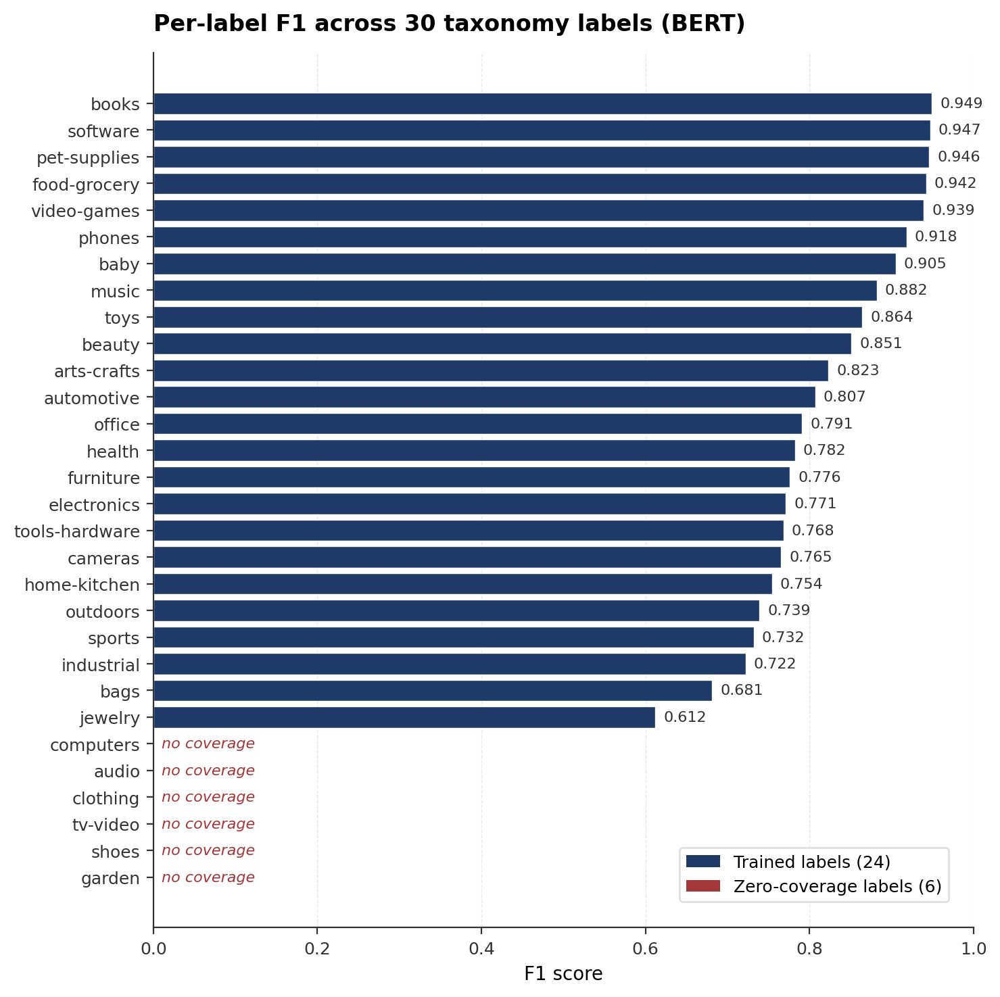
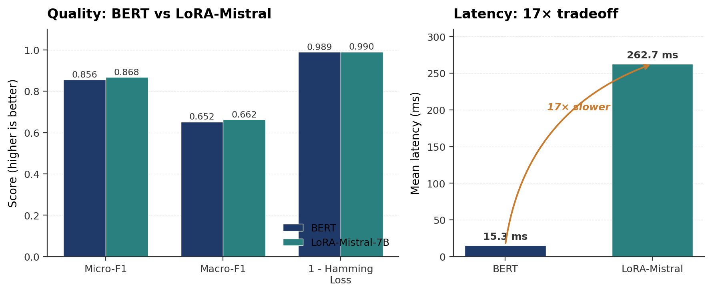

# Shopify Product Tagger
## A Confidence-Calibrated Multi-Agent LLM Pipeline

**CSCI E-222 · Spring 2026**

Harvard Extension School

Felicia D. O'Garro

---

# The Problem

Tagging products on Shopify sounds straightforward — until you're doing it at scale.

- **Slow** — hundreds of SKUs, all tagged by hand
- **Inconsistent** — two people tag the same product differently every time
- **Costly** — wrong tags hurt search ranking and discoverability

**Goal:** Build a pipeline that automatically assigns the right taxonomy tags to any product, given just its title and description.

---

# Why Multi-Agent?

One model can't handle every case well — so I didn't try to force it to.

| Scenario | What's needed |
|----------|--------------|
| Common products | Speed and low cost |
| Ambiguous products | Deeper language understanding |
| Out-of-distribution products | General world knowledge |

**The answer:** Route each product to the right model based on confidence. Fast when sure, more powerful when not.

---

# System Architecture

<div style="font-family: monospace; font-size: 0.85em; line-height: 1.8; background: #f8f8f8; padding: 16px; border-radius: 8px;">
Product (title + description)<br/>
&nbsp;&nbsp;&nbsp;&nbsp;&nbsp;&nbsp;&nbsp;&nbsp;↓<br/>
&nbsp;&nbsp;[1. Preprocessor] — tokenize, deduplicate, enforce length<br/>
&nbsp;&nbsp;&nbsp;&nbsp;&nbsp;&nbsp;&nbsp;&nbsp;↓<br/>
&nbsp;&nbsp;[2. BERT Inference] — always runs first; produces confidence scores<br/>
&nbsp;&nbsp;&nbsp;&nbsp;&nbsp;&nbsp;&nbsp;&nbsp;↓<br/>
&nbsp;&nbsp;[3. Model Selector] — routes based on max confidence<br/>
&nbsp;&nbsp;&nbsp;&nbsp;&nbsp;/&nbsp;&nbsp;&nbsp;&nbsp;&nbsp;&nbsp;&nbsp;&nbsp;|&nbsp;&nbsp;&nbsp;&nbsp;&nbsp;&nbsp;&nbsp;\<br/>
&nbsp;BERT&nbsp;&nbsp;&nbsp;LoRA-Mistral&nbsp;&nbsp;LLM API<br/>
&nbsp;&nbsp;&nbsp;&nbsp;&nbsp;&nbsp;&nbsp;&nbsp;↓<br/>
&nbsp;&nbsp;[4. Tagger] — selected model produces final predictions<br/>
&nbsp;&nbsp;&nbsp;&nbsp;&nbsp;&nbsp;&nbsp;&nbsp;↓<br/>
&nbsp;&nbsp;[5. Validator Agent] — checks tag coverage and confidence floor<br/>
&nbsp;&nbsp;&nbsp;&nbsp;&nbsp;&nbsp;&nbsp;&nbsp;↓<br/>
&nbsp;&nbsp;Predicted Tags + Routing Metadata
</div>

---

# Five Agents

| Agent | Role |
|-------|------|
| **Preprocessor** | Tokenizes, deduplicates, enforces min/max length |
| **BERT Classifier** | Fast inference + confidence estimation (always runs) |
| **Model Selector** | Routes based on max confidence score |
| **LLM API Tagger** | Few-shot Claude Haiku / GPT-4o-mini fallback |
| **Validator** | Flags low-confidence or tag-sparse predictions |

BERT does double duty — it's both the confidence estimator and the primary tagger. The other two paths only activate when BERT isn't sure enough.

---

# Routing Policy

```python
if max_confidence >= 0.75:
    route → BERT          # high confidence — fast, free

elif max_confidence >= 0.50:
    route → LoRA-Mistral  # ambiguous — deeper model

else:
    route → LLM API       # out-of-distribution — general knowledge
```

Cost and latency go up left to right. The goal is to keep most traffic on BERT — cheap, fast, and free.

---

# Methods: Why These Models?

**BERT (fast path)**
- 110M parameters, fine-tuned end-to-end on product text
- `BCEWithLogitsLoss` with per-label `pos_weight` for class imbalance
- Per-label threshold tuning on validation set (0.50–0.90)

**LoRA-Mistral-7B (ambiguous path)**
- QLoRA: base weights quantized to 4-bit, only low-rank adapters trained
- ~8M trainable parameters on top of frozen 7B base
- Feasible on a single A100 GPU — no multi-GPU setup required

**Few-Shot LLM API (out-of-distribution fallback)**
- 5-shot prompt with full taxonomy + example products
- Claude Haiku or GPT-4o-mini — general world knowledge
- Only called when both fine-tuned models are not confident

---

# Data

**Source:** McAuley Lab Amazon Reviews 2023 (HuggingFace Datasets)

| Split | Products |
|-------|----------|
| Train | 61,102 |
| Val   | 7,638 |
| Test  | 7,638 |
| **Total** | **76,378** |

- 21 Amazon categories mapped to 30 taxonomy labels
- Loaded with `streaming=True` — no disk overhead on Colab
- Avg labels per product: **1.08**
- Label coverage: **23 / 30** labels represented in training data

---

# Taxonomy — 30 Labels

```
electronics   computers     phones        audio
cameras       tv-video      clothing      shoes
jewelry       bags          beauty        health
sports        outdoors      home-kitchen  furniture
garden        tools-hardware automotive   toys
baby          books         music         video-games
office        pet-supplies  food-grocery  arts-crafts
industrial    software
```

Designed to map directly to Shopify's standard product taxonomy.

---

# Phase 2 — BERT Baseline Results

| Metric | Score |
|--------|-------|
| **Micro-F1** | **0.856** |
| **Macro-F1** | **0.652** |
| Hamming Loss | 0.011 |
| Coverage Error | 1.528 |

**Inference latency — single sample, A100**

| mean | median | p95 | p99 |
|------|--------|-----|-----|
| 15.3 ms | 15.3 ms | 15.7 ms | 15.9 ms |

---

# BERT — Training Curves


Loss and validation F1 over 5 epochs. Micro-F1 peaks at epoch 5 — no overfitting observed.

---

# BERT — Per-Label F1



Seven labels score 0.0 — none of those categories had enough representation in the training data. The 23 covered labels perform well, with seven of them above F1 = 0.93.

---

# Phase 3 — LoRA-Mistral-7B Results

| Metric | BERT | LoRA-Mistral | Δ |
|--------|------|-------------|---|
| **Micro-F1** | 0.856 | **0.868** | +0.012 |
| **Macro-F1** | 0.652 | **0.662** | +0.010 |
| Hamming Loss | 0.011 | **0.010** | -0.001 |
| Coverage Error | 1.528 | **1.478** | -0.050 |



---

# Latency Comparison

| Model | Mean | p95 | vs BERT |
|-------|------|-----|---------|
| BERT | 15.3 ms | 15.7 ms | 1× |
| LoRA-Mistral | 262.7 ms | 267.1 ms | **17× slower** |
| LLM API | ~800 ms + network | — | ~50× slower (est.) |

**This tradeoff is exactly why routing matters.**

- BERT handles high-confidence products in ~15ms
- LoRA-Mistral only fires on ambiguous inputs
- LLM API is a last resort for truly out-of-distribution cases

---

# Phase 5 — Routing Results


Routing across 497 demo products. BERT hit max confidence ≥ 0.75 on every in-distribution product — no surprises there for a held-out test set. Validator flagged: **0 / 497**.

---

# Example Predictions

| Product | Predicted Tags | Model |
|---------|---------------|-------|
| Gotoh Modern Bridge for Tele | music | BERT |
| JOYIN 72 Pcs Animal Easter Eggs | toys | BERT |
| GREENARK Replacement Canon CLI-251 | office | BERT |
| Top Collection Enchanted Garden | home-kitchen, furniture | BERT |
| KZ ZS6 HiFi Quad Driver Earphones | music | BERT |
| Penny Rose Paper Dolls Bakery | toys, arts-crafts | BERT |
| Wearable4U H&K VP9 Airsoft | sports, outdoors | BERT |

---

# Interactive Gradio Demo

**Live product tagger with full routing visibility**

- Input: product title + description
- Output: predicted tags with confidence scores
- Routing Decision panel: which model ran, why, flagged status

Built with `gradio.Interface` + `share=True` for a public URL in Colab.

---

# Strengths, Limitations & Future Work

**What worked**
- Covered labels are strong — seven above F1 = 0.93
- LoRA-Mistral beats BERT on every metric after just 3 epochs
- Cost-efficient by design — most traffic never touches a paid API

**What didn't**
- 7 of 30 labels have zero training coverage; those all land at F1 = 0.0
- Routing thresholds are manually set — there's room to learn them
- LoRA and LLM API routes aren't exercised on in-distribution test data

**What's next**
- Active learning to close the label coverage gap
- Merchant feedback loop for continual improvement
- API integration to tag products without leaving the storefront

---

# Conclusion

A confidence-calibrated multi-agent pipeline that:

1. **Preprocesses** product text and deduplicates before anything else
2. **Classifies** with BERT — 85.6% micro-F1 at 15ms per product
3. **Routes** ambiguous cases to LoRA-Mistral or the LLM API
4. **Validates** every prediction before it goes back to the merchant
5. **Stays cheap** — most traffic never touches a paid API

**GitHub:** `github.com/fdogarro/multilabel-product-classifier`

---

# Video Presentation

**Watch the full 7–15 minute demo and walkthrough:**

`[INSERT VIDEO URL HERE]`

*(YouTube / Zoom / Panopto)*

**GitHub:** `github.com/fdogarro/multilabel-product-classifier`
